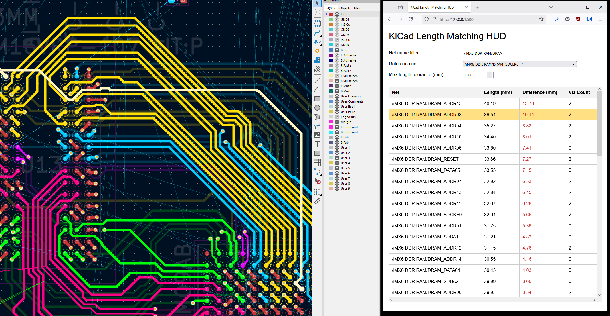

# KiCad Length Matching HUD

Quick and dirty length matching heads-up display for KiCad

Designed to assist with length-matching tracks in a parallel bus, this tool connects to a running KiCad interface and calculates the lengths of a set of nets, as well as comparing them to the length of a reference net.

This is just a quick demo of how it could work.

Features:
* Real-time update, refreshes every 3 seconds
* Hovering over a net in the tool highlights it in KiCad

TODO:
* Add via lengths to the count
* Seperate track lengths per layer
* Calculate matches in terms of delay instead of length, per layer
* Support additional per-pin delays (from part packaging)
* Allow grouping by net class, reference length targets per net class

Usage instructions:
1. Clone this repo
2. Create a python virtual environment, and install the requirements
3. Start KiCad 9, enable the remote API (preferences->plugins->Enable KiCad API), and open a board file
3. Start the server using 'python app.py'
4. Open 'http://127.0.0.1:5000/' in a web browser
5. Change the 'net name filter', 'reference net', and 'max length tolerance' parameters to match your project
6. Use the track length tuning filter to modify the length of an offending net. Deselect the tool to allow the HUD to refresh
7. Repeat until all nets are within timing.
