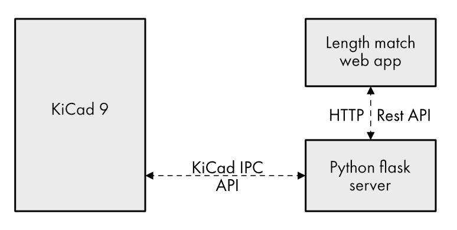

# KiCad Length Matching Heads-up Display

Quick and dirty length matching heads-up display for KiCad

Designed to assist with length-matching tracks in a parallel bus, this tool connects to a running KiCad interface and calculates the lengths of a set of nets, as well as comparing them to the length of a reference net.

Features:
* Real-time update, refreshes every 2 seconds
* Hovering over a net in the tool highlights it in KiCad

TODO:
* Separate track lengths per layer
* Calculate matches in terms of delay instead of length, per layer
* Support additional per-pin delays (from part packaging)
* Allow grouping by net class, reference length targets per net class
* Support blind/buried vias

# Usage instructions:
1. Clone this repo
2. Create a python virtual environment, and install the requirements
3. Start KiCad 9, enable the remote API (preferences->plugins->Enable KiCad API), and open a board file
3. Start the server using 'python app.py'
4. Open 'http://127.0.0.1:5000/' in a web browser
5. Change the 'net name filter', 'reference net', and 'max length tolerance' parameters to match your project. These parameters are saved in your local browser storage.
6. Use the track length tuning filter to modify the length of an offending net. Deselect the tool to allow the HUD to refresh.
7. Repeat until all nets are within timing.

Tips:
* Hover the mouse over a trace in the web app, to highlight it on the board
* Click on a trace on the board, to highlight it in the web app
* Click on any of the table headers (net, length, etc) to sort the table by that parameter

# Architecture

The KiCad Length Matching HUD consists of three components:

1. A web app implemented using HTML and Javascript, which presents the frontend to the user.
2. A [flask](https://flask.palletsprojects.com/en/stable/) web server, that serves static content for the web app, as well as a REST API for interacting with KiCad
3. A connection to a running KiCad 9 instance, using the [KiCad IPC API](https://dev-docs.kicad.org/en/apis-and-binding/ipc-api/) (specifically the [python bindings](https://gitlab.com/kicad/code/kicad-python))

